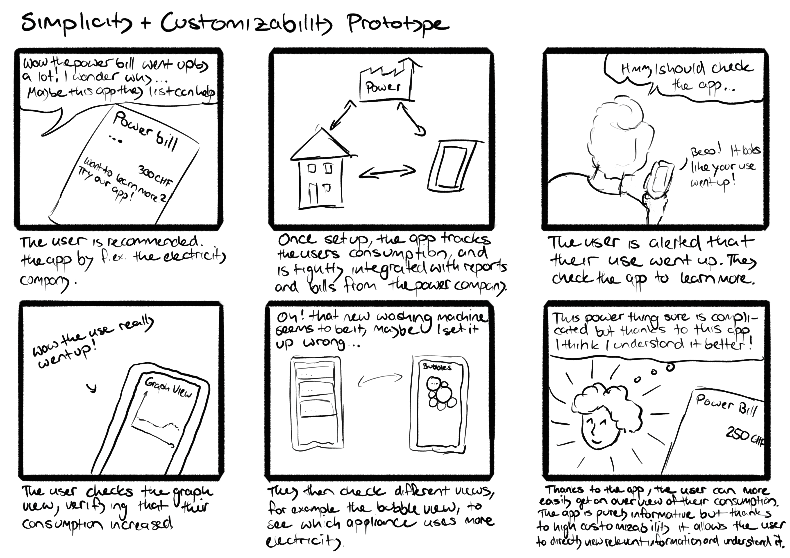
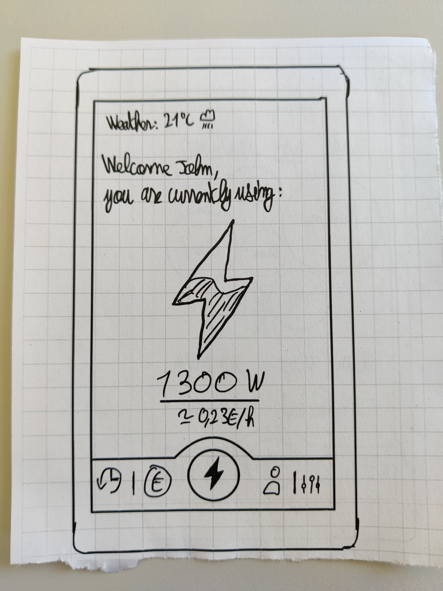
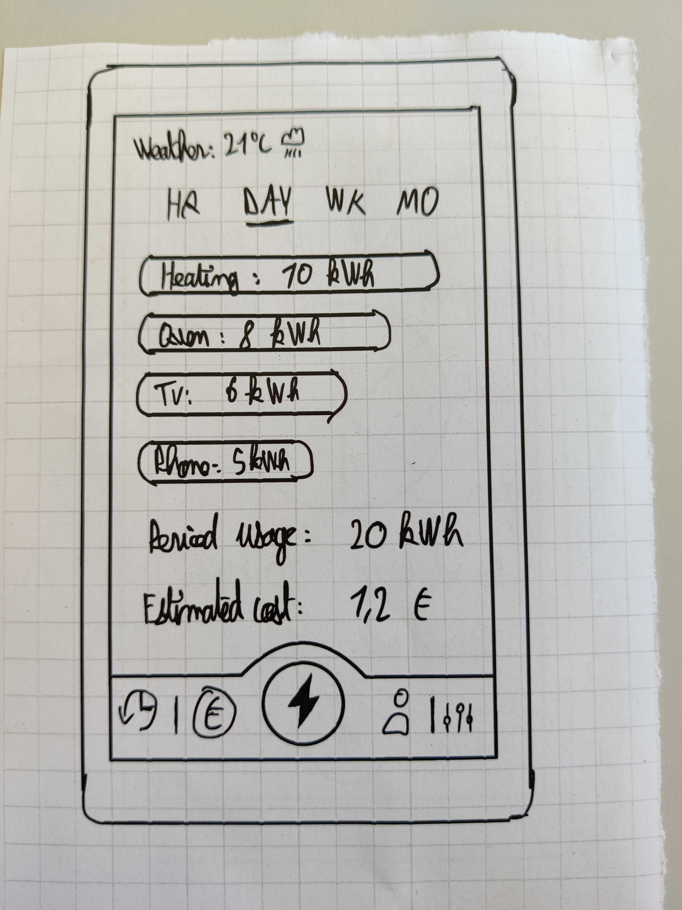

   &nbsp; &nbsp;
       

# Electricity Use, Group 06
#### Lothaire Aubergeon, Ian Hutter, Sophie Leichtle, Marco Schöb, Markus Wagner

## Project description

The goal of the project, which we have selected, wants to provide a solution to overcome the problem of electricity overuse in our world. We want to develop an application, which makes households more aware of their energy consumption and encourages them to consume less. 
What motivates us the most is that this is a pressing problem in the need for a solution in order to minimize climate change.

## Ideation
### Summary of sources
We found many different sources ranging from website and smartphone applications with and without additional hardware sensors via guidebooks to articles describing the electricity overuse in our society or providing useful tricks to save energy with little effort. 

Most scientific as well as popular articles concluded that curtailment of electricity use (including unplugging of not-used devices) is more efficient than more efficient appliances. In order to reach this goal, the people need to be made aware of their energy consumption. There are several approaches for this such as advertisements, a broader social discourse as well as smartphone apps, which will be discussed further below. Moreover, making the people more aware of the impact that their energy use has on the environment, resulted in a significant decrease in energy consumption. 

The most related solutions regarding the energy overuse topic are two smartphone appliances and an online tool:
The first one is an online energy-calculator by EWZ, the electricity provider of the city of Zurich. After answering some questions such as the age of the apartment or house, respectively, the number of people living there and the kind of heating (oil-fired, electricity etc.), it shows the user a rough list of how much energy he or she has consumed in kWh and how much it will cost in CHF. The calculation is based on some default values derived from the questions answered.
The second approach that we found makes use of additional hardware sensors, which can measure the flow of electricity coming through the user’s electric panel and comes with a smartphone application using machine learning for evaluating the data. The app shows much more detailed information on the energy consumption such as when which device was in use. Furthermore, it can send notifications to the user when the app thinks that he or she forgot to shut down an appliance.
The third solution is the EDF & MOI smartphone app by the French electricity provider EDF. It shows the user his or her energy consumption in customizable time intervals in Euros or kWh as the user’s will. One can set a yearly goal which the user wants to reach and can receive the yearly bill divided into appliance categories.

The first image shows some screenshots from the hardware-based smartphone application and the second one the EDF & MOI app.

    
### "How might we" statements
    - How might we win people out of different demographics and with political options?
    - How might we incentivise people to use the app and keep using it? (How do we get them to care?)
    - How might we display the user’s energy use in a way they can understand?
    - How might we evaluate the impact/success of the app?
    - How might we integrate the app with other technologies/devices?

### Brainstorming

We took the brainstorming approach B where each of us first tried to find as many ideas as possible in 10 minutes. Afterwards we discussed the ideas and grouped them into
four categories and connected some of the ideas with relevance to each other. This was done in person using Miro.

## Low-fidelity Prototype

We started on Miro, grouping ideas we had into each our own ideas for a specific prototype. We then merged some that were similar and ended up with our three ideas: eco, gameification and simplicity/customizability. From there we created our storyboards, trying to figure out what kind of situations our prototypes would be fit for. After that, we started work on the protoype, starting from what kind of features and interactions we wanted and moving on to how to display them.

### Idea A (gamification prototype)

Our process for this prototype was that we first took many of the ideas from the brainstorming that included gamification and grouped them together. We then picked out some of them that seemed like a good fit and rounded out the prototype through discussing it. This idea was then drawn on paper into a paper prototype which meant that we had to start thinking about the visual design of it. This whole process resulted in a horizontal prototype that encompasses many of the aspects that a possible final app would have.

The ranking screen is central to the app, allowing you to compare yourself with others:

### Idea B (ecologic prototype)

The basic idea behind the ecologic prototype is that it shows you the impact of your electricity consumption but more importantly what you can do about it. Consequently the start/main menu has four panels that display the possible electricity savings in the top one, the current use on the middle-left panel, the impact of this use in the middle- right one and your use statistics on the bottom one.

Either by pressing one of the panels or on of the symbols in the taskbar on the bottom you get to the main menu current use, impact, statistics or tips page were you can see your different stats and edit the ones that are displayed in the main menu. The last symbol in the taskbar brings you to the settings page.

### Idea C (simple prototype)

    
The idea of this prototype is that the app solely displays data in a way that is simple and customizable, thus motivating the User to utilize it solely through ease of use. It allows the user to display data in a way they personally can understand and makes it easy to change up how things are displayed. The user can chose between five different visualizations, as well as switch between a representation in EUR or in kWh.

## Mid-fidelity Prototype

### Idea A

### Idea B (Gamification Prototype)

This prototype is for a mobile app consisting of four main screens (and a login screen that is shown when you install the app for the first time). The bottom navigation allows the user to easily switch between the four screens.

First up is the dashboard, which shows the user how many coins they have earned that day and two shortcut buttons to quickly jump to a certain ranking.

Next is the ranking screen, where the user can check how well they are doing in different rankings. The prototype allows switching between two different groups and two different timeframes through dropdown menus at the top.

The third screen is the shop, where a user is able to buy certain enhancements or items. At the bottom the user is able to see how many coins they have earned and how many are still left to spend.

The last screen is the profile page, where the user profile and important settings can be changed. From here you can also delete your account which leads you back to the login screen.

## Hi-fidelity Prototype

    TODO
    
## User study

    TODO
